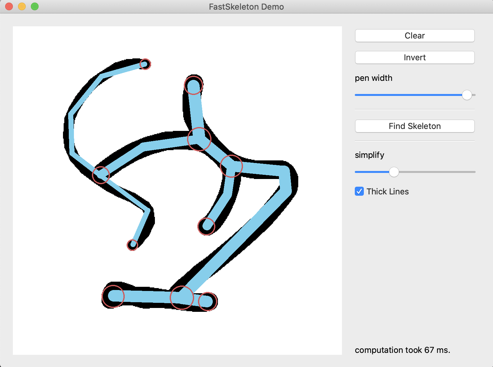
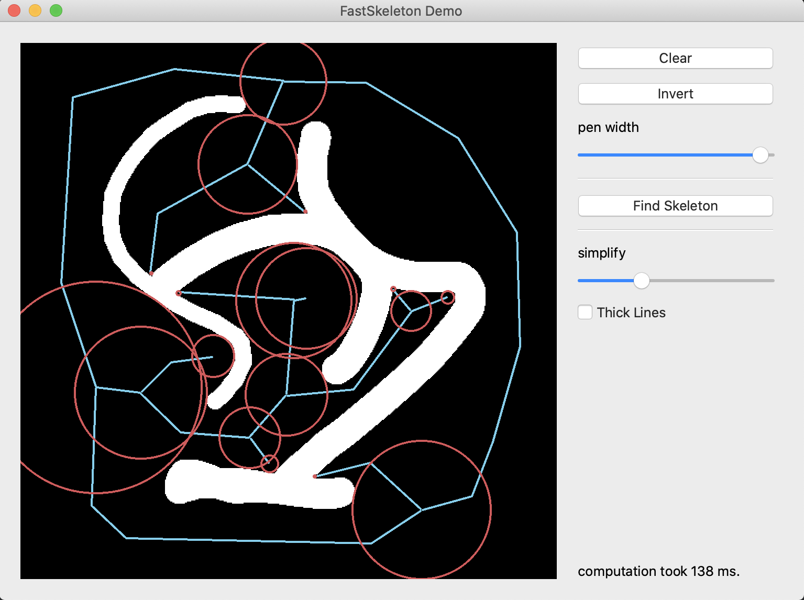

# FastSkeleton

Computes polygonal skeletons from discrete data (i.e. images).

In complex use cases, this many magnitudes faster than purely
polygonal approaches like <a href="https://doc.cgal.org/latest/Straight_skeleton_2/index.html">CGAL's StraightSkeleton</a>.

You can use this to quickly turn images of lines or graphs into a
vector representation. It will not properly resolve circular graphs though. In rare cases, it
fails to detect nodes of degree 3 or higher.

Achieves its speed by leveraging <a href="https://docs.scipy.org/doc/scipy/reference/ndimage.html">scipy.ndimage</a>,
<a href="https://scikit-image.org/">scikit-image</a>, <a href="http://numba.pydata.org/">numba</a>, and using lookup
tables and allocation-free data structures where possible.

# Screenshots





# References

The general approach implemented here (for detecting nodes and
their connectivity) is described in:

```
Dirnberger, M., Kehl, T., & Neumann, A. (2015). NEFI:
Network Extraction From Images. Scientific reports, 5,
15669. https://doi.org/10.1038/srep15669
```

This implementation adds (1) exact tracing of connection paths
once the nodes are discovered and (2) time (distance) information.

# License

MIT
